# 🤖 Text-to-SQL Multi-Agent Pipeline System
## 🚀 Natural Language to SQL Query Conversion Using AI Agents

<div align="center">
  <h2>🚀 Intelligent Natural Language to SQL Conversion</h2>
  <p><em>Transform human questions into executable database queries</em></p>
  
  [](.)
  [](.)
  [](.)
  [](.)
</div>

---

## 📋 Project Overview

This project solves the problem of converting natural language questions into executable SQL queries. Currently, users need to know SQL syntax to query databases, which creates a barrier for business users and analysts. Our solution is an AI-powered system that understands human questions and automatically generates optimized SQL queries, making database access accessible to everyone.

### Objectives
- Convert natural language questions to executable SQL queries
- Implement multi-agent system for intelligent query processing
- Support multiple database types (PostgreSQL, MySQL, etc.)
- Provide direct query execution and result formatting
- Ensure security and prevent SQL injection attacks

**Benefits:**
- **Accessibility**: Non-technical users can query databases
- **Speed**: Get answers in seconds instead of writing SQL
- **Accuracy**: AI agents understand context and generate correct queries
- **Security**: Built-in protection against malicious queries

---

## 🎯 What I'm Building

This section describes the complete AI system that automatically converts natural language questions into SQL queries and executes them. The system uses specialized AI agents that work together to understand user intent, analyze database schemas, generate SQL, validate queries, execute them, and format results beautifully.

**What Gets Built Automatically:**
1. **Query Understanding**: Analyzes natural language and extracts intent
2. **Schema Analysis**: Maps user questions to database structure
3. **SQL Generation**: Creates optimized SQL queries
4. **Query Validation**: Ensures security and correctness
5. **Query Execution**: Runs queries and manages connections
6. **Result Formatting**: Presents data in user-friendly formats

---

## 🏗️ How the System Works

This section explains how the multi-agent pipeline processes natural language questions and converts them to SQL queries. The system works like a conversation where each agent has a specific role in understanding, translating, and executing user requests.

### 🗂️ The Agent Pipeline Flow

```
┌─────────────────┐    ┌─────────────────┐    ┌─────────────────┐    ┌─────────────────┐
│   User Input    │    │  Query Analysis │    │  SQL Generation │    │  Query Execution│
│                 │    │                 │    │                 │    │                 │
│ "Find customers │───▶│ • Intent        │───▶│ • SQL Query     │───▶│ • Database      │
│  with >2 flags" │    │ • Entities      │    │ • Optimization  │    │   Connection    │
│                 │    │ • Context       │    │ • Validation    │    │ • Query Run     │
└─────────────────┘    └─────────────────┘    └─────────────────┘    └─────────────────┘
          ▲                     ▲                       ▲                        ▲
          │                     │                       │                        │
          │                     │                       │                        │
      ┌───────────────────────────────────────────────────────────────────────────────┐
      │                    Result Formatting & Presentation                           │
      │              • Tables • Charts • Export Options • Insights                   │
      └───────────────────────────────────────────────────────────────────────────────┘
```

**What This Means:**
- **User Input**: Natural language question in plain English
- **Query Analysis**: AI understands what the user wants
- **SQL Generation**: Creates the actual database query
- **Query Execution**: Runs the query against the database
- **Result Formatting**: Presents data in a user-friendly way

### 🎯 Core Architecture Overview

```mermaid
graph TD
    %% User Input
    U["🎤 User Input<br/>Natural Language Query"] --> A
    
    %% Main Orchestrator
    A["🎯 Orchestrator Agent<br/>Master Coordinator"] --> B
    A --> C
    A --> D
    A --> E
    A --> F
    A --> G
    
    %% Agents with Simple Descriptions
    B["🧠 Query Understanding Agent<br/>Analyzes user intent & entities"]
    C["🔍 Schema Analysis Agent<br/>Maps to database structure"]
    D["📝 SQL Generation Agent<br/>Creates optimized SQL queries"]
    E["✅ Query Validation Agent<br/>Ensures security & quality"]
    F["🚀 Query Execution Agent<br/>Runs queries & manages data"]
    G["📊 Result Formatting Agent<br/>Presents results beautifully"]
    
    %% Simple Data Flow
    B --> D
    C --> D
    D --> E
    E --> F
    F --> G
    
    %% Output
    G --> O["📤 User Output<br/>Formatted Results"]
    
    %% Clean Styling
    style A fill:#FF6B6B,stroke:#333,stroke-width:3px,color:#fff
    style B fill:#4ECDC4,stroke:#333,stroke-width:2px,color:#fff
    style C fill:#45B7D1,stroke:#333,stroke-width:2px,color:#fff
    style D fill:#96CEB4,stroke:#333,stroke-width:2px,color:#fff
    style E fill:#FFEAA7,stroke:#333,stroke-width:2px,color:#333
    style F fill:#DDA0DD,stroke:#333,stroke-width:2px,color:#fff
    style G fill:#98D8C8,stroke:#333,stroke-width:2px,color:#fff
    
    style U fill:#FFE165,stroke:#333,stroke-width:2px,color:#333
    style O fill:#A8E6CF,stroke:#333,stroke-width:2px,color:#333
```



### 🎯 Detailed Architecture Flow

```mermaid
graph TD
    %% User Input Layer
    U["🎤 User Input<br/>Natural Language Query<br/>'Find orders from 23rd Oct'"] --> A
    
    %% Main Orchestrator
    A["🎯 Orchestrator Agent<br/>Master Coordinator<br/>Pipeline Management"] --> B
    A --> C
    A --> D
    A --> E
    A --> F
    A --> G
    
    %% Query Understanding Agent
    B["🧠 Query Understanding Agent<br/>NLP & Intent Analysis"] --> B1["🔍 Entity Extraction<br/>'orders', 'customers', 'products'"]
    B --> B2["🎯 Intent Recognition<br/>SELECT, AGGREGATE, FILTER"]
    B --> B3["📝 Query Type Classification<br/>Simple, Complex, Join"]
    B --> B4["🔍 Condition Analysis<br/>Dates, Locations, Status"]
    
    %% Schema Analysis Agent
    C["🔍 Schema Analysis Agent<br/>Database Metadata Expert"] --> C1["📋 Table Discovery<br/>Schema Mapping"]
    C --> C2["🔗 Relationship Analysis<br/>Foreign Keys, Joins"]
    C --> C3["📊 Column Mapping<br/>Natural Language → Database"]
    C --> C4["⚡ Performance Insights<br/>Indexes, Constraints"]
    
    %% SQL Generation Agent
    D["📝 SQL Generation Agent<br/>Query Builder & Optimizer"] --> D1["🏗️ Base Query Construction<br/>SELECT, FROM, WHERE"]
    D --> D2["🔗 Join Strategy<br/>INNER, LEFT, RIGHT Joins"]
    D --> D3["📊 Aggregation Logic<br/>COUNT, SUM, AVG, GROUP BY"]
    D --> D4["⚡ Query Optimization<br/>Performance Tuning"]
    
    %% Query Validation Agent
    E["✅ Query Validation Agent<br/>Security & Quality Guardian"] --> E1["🛡️ Security Validation<br/>SQL Injection Prevention"]
    E --> E2["🔍 Syntax Validation<br/>SQL Grammar Check"]
    E --> E3["⚡ Performance Analysis<br/>Query Plan Review"]
    E --> E4["📊 Complexity Assessment<br/>Resource Usage"]
    
    %% Query Execution Agent
    F["🚀 Query Execution Agent<br/>Database Operations Manager"] --> F1["🔌 Connection Management<br/>Pooling & Optimization"]
    F --> F2["⚡ Query Execution<br/>Timeout & Error Handling"]
    F --> F3["📊 Result Processing<br/>Data Fetching & Pagination"]
    F --> F4["📈 Performance Monitoring<br/>Execution Metrics"]
    
    %% Result Formatting Agent
    G["📊 Result Formatting Agent<br/>Data Presentation Expert"] --> G1["📋 Table Formatting<br/>Structured Output"]
    G --> G2["📈 Chart Generation<br/>Visualizations"]
    G --> G3["📄 Export Options<br/>CSV, JSON, Excel"]
    G --> G4["📝 Summary Creation<br/>Insights & Analytics"]
    
    %% Data Flow Connections
    B1 --> C1
    B2 --> D1
    B3 --> D2
    B4 --> D3
    
    C1 --> D1
    C2 --> D2
    C3 --> D1
    C4 --> D4
    
    D1 --> E1
    D2 --> E2
    D3 --> E3
    D4 --> E4
    
    E1 --> F1
    E2 --> F2
    E3 --> F3
    E4 --> F4
    
    F1 --> G1
    F2 --> G2
    F3 --> G3
    F4 --> G4
    
    %% Final Output
    G1 --> O["📤 User Output<br/>Formatted Results<br/>Tables, Charts, Insights"]
    G2 --> O
    G3 --> O
    G4 --> O
    
    %% Styling for Visual Appeal
    style A fill:#FF6B6B,stroke:#333,stroke-width:4px,color:#fff
    style B fill:#4ECDC4,stroke:#333,stroke-width:3px,color:#fff
    style C fill:#45B7D1,stroke:#333,stroke-width:3px,color:#fff
    style D fill:#96CEB4,stroke:#333,stroke-width:3px,color:#fff
    style E fill:#FFEAA7,stroke:#333,stroke-width:3px,color:#333
    style F fill:#DDA0DD,stroke:#333,stroke-width:3px,color:#fff
    style G fill:#98D8C8,stroke:#333,stroke-width:3px,color:#fff
    
    style U fill:#FFE165,stroke:#333,stroke-width:3px,color:#333
    style O fill:#A8E6CF,stroke:#333,stroke-width:3px,color:#333
    
    %% Sub-agent styling
    style B1 fill:#E8F4FD,stroke:#333,stroke-width:2px
    style B2 fill:#E8F4FD,stroke:#333,stroke-width:2px
    style B3 fill:#E8F4FD,stroke:#333,stroke-width:2px
    style B4 fill:#E8F4FD,stroke:#333,stroke-width:2px
    
    style C1 fill:#E8F8F5,stroke:#333,stroke-width:2px
    style C2 fill:#E8F8F5,stroke:#333,stroke-width:2px
    style C3 fill:#E8F8F5,stroke:#333,stroke-width:2px
    style C4 fill:#E8F8F5,stroke:#333,stroke-width:2px
    
    style D1 fill:#FDF2E9,stroke:#333,stroke-width:2px
    style D2 fill:#FDF2E9,stroke:#333,stroke-width:2px
    style D3 fill:#FDF2E9,stroke:#333,stroke-width:2px
    style D4 fill:#FDF2E9,stroke:#333,stroke-width:2px
    
    style E1 fill:#FFF2E0,stroke:#333,stroke-width:2px
    style E2 fill:#FFF2E0,stroke:#333,stroke-width:2px
    style E3 fill:#FFF2E0,stroke:#333,stroke-width:2px
    style E4 fill:#FFF2E0,stroke:#333,stroke-width:2px
    
    style F1 fill:#E8F5E8,stroke:#333,stroke-width:2px
    style F2 fill:#E8F5E8,stroke:#333,stroke-width:2px
    style F3 fill:#E8F5E8,stroke:#333,stroke-width:2px
    style F4 fill:#E8F5E8,stroke:#333,stroke-width:2px
    
    style G1 fill:#F0F8FF,stroke:#333,stroke-width:2px
    style G2 fill:#F0F8FF,stroke:#333,stroke-width:2px
    style G3 fill:#F0F8FF,stroke:#333,stroke-width:2px
    style G4 fill:#F0F8FF,stroke:#333,stroke-width:2px
```




---

## 🔍 Example: Credit Risk Analysis Query

### User Question
**"Find me customers of credit lending having more than 2 alert flags"**

### Agent Processing Flow

#### 1. 🧠 Query Understanding Agent
- **Intent**: SELECT customers with COUNT(alert_flags) > 2
- **Entities**: customers, credit lending, alert_flags
- **Context**: Financial/credit risk assessment domain

#### 2. 🔍 Schema Analysis Agent
- **Table Discovery**: 
  - `customers` table (customer_id, name, email, credit_score, etc.)
  - `credit_alert_flags` table (flag_id, customer_id, alert_type, severity, flag_date, description)
  - `credit_applications` table (application_id, customer_id, status, loan_amount, risk_level)
- **Relationship Mapping**: customers → credit_alert_flags (one-to-many)

#### 3. 📝 SQL Generation Agent
```sql
SELECT 
    c.customer_id,
    c.first_name,
    c.last_name,
    c.email,
    c.credit_score,
    COUNT(caf.flag_id) as alert_flag_count,
    STRING_AGG(caf.alert_type, ', ') as alert_types,
    MAX(caf.severity) as highest_severity,
    MAX(caf.flag_date) as latest_alert_date
FROM customers c
INNER JOIN credit_alert_flags caf ON c.customer_id = caf.customer_id
WHERE caf.alert_type IN ('payment_delay', 'credit_limit_exceeded', 'fraud_suspicion', 'income_verification_failed')
GROUP BY c.customer_id, c.first_name, c.last_name, c.email, c.credit_score
HAVING COUNT(caf.flag_id) > 2
ORDER BY alert_flag_count DESC, c.credit_score ASC;
```

#### 4. ✅ Query Validation Agent
- **Security Check**: ✅ No SQL injection vulnerabilities
- **Syntax Check**: ✅ Valid PostgreSQL syntax with STRING_AGG
- **Performance Check**: ✅ Uses proper indexes on customer_id and flag_date
- **Business Logic**: ✅ Filters relevant alert types for credit risk assessment

#### 5. 🚀 Query Execution Agent
- **Connection**: Establishes database connection
- **Execution**: Runs the query with timeout protection
- **Results**: Fetches data with pagination

#### 6. 📊 Result Formatting Agent
- **Table Format**: Structured customer risk data with alert details
- **Summary**: Risk analysis, flag distribution, and recommendations
- **Export Options**: CSV, Excel, JSON, PDF reports
- **Visualization**: Risk heatmap and trend analysis charts

### 📊 Expected Output

#### 🔴 High-Risk Customer Alert Dashboard

**Query Results Summary:**
- **Total High-Risk Customers**: 4
- **Average Alert Flags**: 3.75 per customer
- **Risk Distribution**: 2 High, 1 Medium, 1 Low severity
- **Latest Alert**: 2024-01-15 (Fraud suspicion)

---

#### 📋 Customer Risk Analysis Table

| Customer | Credit Score | Alert Flags | Alert Types | Severity | Latest Alert |
|----------|--------------|-------------|-------------|----------|--------------|
| **John Smith** | 580 | 5 | Payment Delay, Credit Limit, Fraud | 🔴 HIGH | 2024-01-15 |
| **Sarah Johnson** | 620 | 4 | Payment Delay, Income Verification | 🟡 MEDIUM | 2024-01-12 |
| **Mike Brown** | 650 | 3 | Credit Limit, Payment Delay | 🟡 MEDIUM | 2024-01-10 |
| **Lisa Davis** | 590 | 3 | Fraud Suspicion, Income Verification | 🔴 HIGH | 2024-01-08 |

---

#### 🚨 Risk Assessment Insights

**Immediate Actions Required:**
- **John Smith**: Account freeze recommended (5 flags, HIGH severity)
- **Lisa Davis**: Enhanced monitoring needed (fraud suspicion)
- **Sarah Johnson**: Payment plan restructuring suggested
- **Mike Brown**: Credit limit review required

**Business Impact:**
- **Portfolio Risk**: 15.2% increase in high-risk exposure
- **Revenue Impact**: $45,000 in outstanding payments at risk
- **Compliance Status**: Meets regulatory reporting requirements

---

## 🎨 Visual Output Representation

### 📊 Dashboard View (What Users Actually See)

```
┌─────────────────────────────────────────────────────────────────────────────────────┐
│                    🚨 CREDIT RISK ALERT DASHBOARD                                 │
│                    Generated from: "Find me customers with >2 alert flags"        │
├─────────────────────────────────────────────────────────────────────────────────────┤
│                                                                                     │
│  📈 QUERY EXECUTION SUMMARY                                                        │
│  ┌─────────────────────────────────────────────────────────────────────────────┐   │
│  │ Total Records: 4 | Execution Time: 0.8s | Database: credit_lending_prod   │   │
│  │ Generated SQL: SELECT c.customer_id, c.first_name... (View Full Query)     │   │
│  └─────────────────────────────────────────────────────────────────────────────┘   │
│                                                                                     │
│  🔴 HIGH-RISK CUSTOMERS (4 found)                                                 │
│  ┌─────────────────────────────────────────────────────────────────────────────┐   │
│  │ ⚠️  John Smith (ID: 1001) - 5 Alert Flags - CREDIT SCORE: 580             │   │
│  │    Alert Types: Payment Delay, Credit Limit Exceeded, Fraud Suspicion      │   │
│  │    Latest: 2024-01-15 | Severity: HIGH | Risk Level: CRITICAL             │   │
│  │                                                                             │   │
│  │ ⚠️  Lisa Davis (ID: 1004) - 3 Alert Flags - CREDIT SCORE: 590             │   │
│  │    Alert Types: Fraud Suspicion, Income Verification Failed                │   │
│  │    Latest: 2024-01-08 | Severity: HIGH | Risk Level: HIGH                 │   │
│  │                                                                             │   │
│  │ ⚠️  Sarah Johnson (ID: 1002) - 4 Alert Flags - CREDIT SCORE: 620          │   │
│  │    Alert Types: Payment Delay, Income Verification Failed                  │   │
│  │    Latest: 2024-01-12 | Severity: MEDIUM | Risk Level: MEDIUM             │   │
│  │                                                                             │   │
│  │ ⚠️  Mike Brown (ID: 1003) - 3 Alert Flags - CREDIT SCORE: 650             │   │
│  │    Alert Types: Credit Limit Exceeded, Payment Delay                       │   │
│  │    Latest: 2024-01-10 | Severity: MEDIUM | Risk Level: MEDIUM             │   │
│  └─────────────────────────────────────────────────────────────────────────────┘   │
│                                                                                     │
│  📊 RISK ANALYSIS INSIGHTS                                                        │
│  ┌─────────────────────────────────────────────────────────────────────────────┐   │
│  │ 🚨 Portfolio Risk: 15.2% increase in high-risk exposure                   │   │
│  │ 💰 Revenue at Risk: $45,000 in outstanding payments                       │   │
│  │ 📋 Compliance: Meets regulatory reporting requirements                     │   │
│  │ 🎯 Recommended Actions: Account freeze for John Smith, enhanced monitoring │   │
│  └─────────────────────────────────────────────────────────────────────────────┘   │
│                                                                                     │
│  [📥 Export CSV] [📊 Generate Report] [🔍 Drill Down] [⚙️ Alert Settings]      │
│                                                                                     │
└─────────────────────────────────────────────────────────────────────────────────────┘
```

### 🔍 Real-World Business Query Examples

#### Example 1: Sales Performance Analysis
**Query**: "Show me top 10 sales representatives by revenue in Q4 2023"

**Generated SQL**:
```sql
SELECT 
    e.first_name, e.last_name, e.department,
    SUM(oi.quantity * oi.unit_price) as total_revenue,
    COUNT(DISTINCT o.order_id) as orders_count
FROM employees e
JOIN orders o ON e.employee_id = o.employee_id
JOIN order_items oi ON o.order_id = oi.order_id
WHERE o.order_date >= '2023-10-01' 
  AND o.order_date <= '2023-12-31'
  AND o.status = 'completed'
GROUP BY e.employee_id, e.first_name, e.last_name, e.department
ORDER BY total_revenue DESC
LIMIT 10;
```

#### Example 2: Inventory Optimization
**Query**: "Find products with low stock but high demand in the last 30 days"

**Generated SQL**:
```sql
SELECT 
    p.name, p.sku, p.stock_quantity,
    COUNT(oi.order_id) as demand_count,
    AVG(oi.quantity) as avg_order_quantity,
    CASE 
        WHEN p.stock_quantity < 20 THEN 'CRITICAL'
        WHEN p.stock_quantity < 50 THEN 'LOW'
        ELSE 'SUFFICIENT'
    END as stock_status
FROM products p
JOIN order_items oi ON p.product_id = oi.product_id
JOIN orders o ON oi.order_id = o.order_id
WHERE o.order_date >= CURRENT_DATE - INTERVAL '30 days'
GROUP BY p.product_id, p.name, p.sku, p.stock_quantity
HAVING p.stock_quantity < 50
ORDER BY demand_count DESC, p.stock_quantity ASC;
```

---

## 🛠️ Technical Implementation

### Core Technologies
- **Python 3.9+**: Main programming language
- **LangChain**: AI agent framework
- **PostgreSQL**: Primary database (extensible to others)
- **FastAPI**: Web API framework
- **Docker**: Containerization

---

## 🚀 Getting Started

### Quick Setup
```bash
# Clone and setup
git clone <repository>
cd text_to_sql_agents

# Start with Docker
docker-compose up -d

# Run demo
python demo.py
```

### Sample Queries
- "Show me customers who spent more than $1000 last month"
- "Find products with low stock and high demand"
- "List employees by department with their salaries"
- "What's the average order value by city?"

---

## 🎯 Future Enhancements

- **Multi-Database Support**: MySQL, SQL Server, Oracle
- **Advanced Analytics**: Chart generation, trend analysis
- **Query Learning**: Improve accuracy from user feedback
- **Enterprise Features**: Role-based access, audit logging
- **API Integration**: RESTful endpoints for applications

---

## 📊 Success Metrics

- **Query Accuracy**: >95% correct SQL generation
- **Response Time**: <2 seconds for simple queries
- **User Satisfaction**: Natural language understanding score
- **Database Coverage**: Support for complex schemas
- **Security**: Zero SQL injection vulnerabilities

---

*This system transforms database access from a technical skill to a natural conversation, making data insights accessible to everyone in your organization.* 
